# Bosch XDK onboarding 

## 1. Introduction

This document contains instructions on how to onboard XDK and compile XDK
firmware. Onboarding is proccess when the XDK is able to send data to cloud.
It begins with a list of prerequisities and guidelines on how to get the code,
compile and onboard the XDK, and start sending data to the cloud.

## 2. Prerequisities

### 2.1. List of components

-  Virtual box (not necessary if you have a Windows PC)
-  Windows (in this tutorial, Window 10 Home Edition is used)
-  [XDK Workbench release 1.7.0](http://xdk.bosch-connectivity.com/software-downloads) (1.6.0 is also supported) 
-  [relayr XDK firmware](https://github.com/relayr/xdk-mqtt)
-  XDK serial number (for use with your Bosch account)

## 3. Installing Windows on a virtual machine

If you don't have a Windows computer, you must set up a virtual machine and
install Windows on it. In this example, we'll be using Windows 10 Home
Edition.

1.  Download and install [VirtualBox](https://www.virtualbox.org/wiki/Downloads)
 (If you have a Mac, choose: "VirtualBox 5.0.20 for OS X hosts" →  amd64)
2.  Download the ISO image of [Windows 10](https://www.microsoft.com/en-us/software-download/windows10ISO). Choose the 64-bit version, and select your preferred language.
3.  When the download is finished, open VirtualBox and click on "New":  
  
4.  Name your new Virtual Machine as "Windows 10", and VirtualBox will automatically select the settings for Windows 10. Then, click on continue.  
  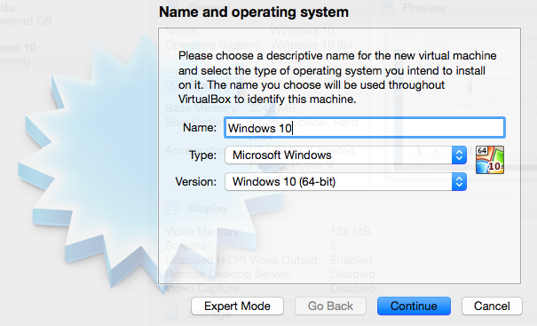 
5.  Continue with all of the default options. When asked for a Hard Disk, select "Create a virtual hard disk now," and then click "Create."
6.  On the next step, select **VDI (VirtualBox Disk Image)** and click **Continue.**
7.  Now, select **Fixed size** and continue.
8.  Name your virtual hard disk and allocate a space of no less than **16GB.**
9.  Click "Create" and continue with all the default options if asked.
10.  On the main window, on VirtualBox, click on your brand new virtual machine, and scroll down to **Storage.** Now click on "Optical Drive" (see picture below, marked in blue).  
  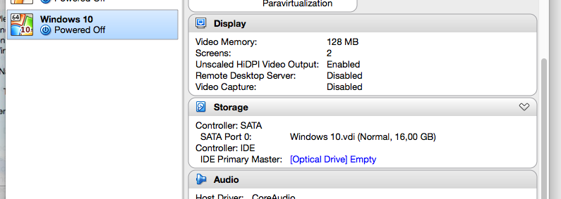
11.  Select the iso image of Windows 10 that you downloaded before, in the first steps of the tutorial.
12.  Now click on "Start" to run the virtual machine; shortly you will see the Windows 10 boot screen.  
  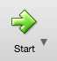
13.  Now install Windows normally, using the default options; when prompted for a "product key," select "I don't have a product key" (you can continue using Windows indefinitely without activation).
14.  Once you're set, you can start and shut down the virtual machine.
 
## 4. Setting up the XDK Workbench

These instructions are to be performed on a Windows computer or on your brand
new Virtual Machine created in Section 3.

1.  Go to [XDK Workbench download page](http://xdk.bosch-connectivity.com/software-downloads).
2.  If you don't have an account, please follow the steps provided by the application to create one. The serial number of your XDK is required to download the workbench.
3.  Log in with your Bosch account and download the [XDK Workbench (release 1.6.0)](http://xdk.bosch-connectivity.com/software-downloads).
4.  Install it with the default options (i.e. don't modify the default folder or anything).
5.  Download the latest version of the repository with the relayr [XDK project](https://codeload.github.com/relayr/xdk-mqtt/zip/master), or [here](https://github.com/relayr/xdk-mqtt/tree/dev-ev), and uncompress it in "C:/" (in the root folder of the hard drive).
6.  Install it with the default options in the folder chosen by the installer.
7.  You should now have two new folders on your hard drive as shown below:
    
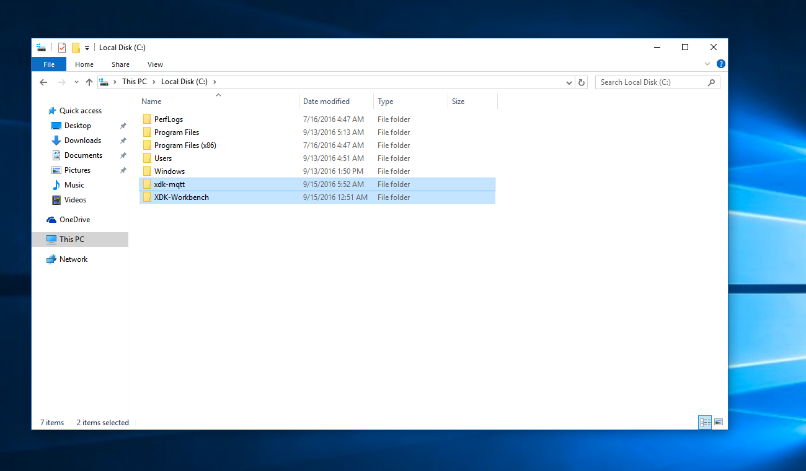
 
 
## 5. Importing the project into XDK Workbench

Now let's import the project into the XDK Workbench so that we cna flash the XDK:

1.  Open the XDK Workbench.  
  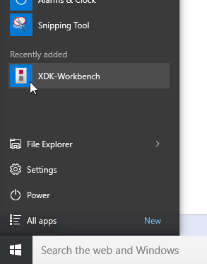
2.  The first time you open it, it will ask you to set a password. Ignore this (click "No") and continue.
3.  Close the Welcome tab that displays upon opening the program.  
  **IMPORTANT: DO NOT UPGRADE THE WORKBENCH! IGNORE THE "NEW VERSION" MESSAGES!**
4.  Next, click on "File" → "New" → "Project".
5.  Inside the category "C/C++", select "Makefile Project with Existing Code."  
  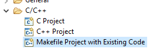
6.  In the following window, enter a name for your project, select the location of the relayr XDK project, and select the **BCDS XDK Toolchain.**  
  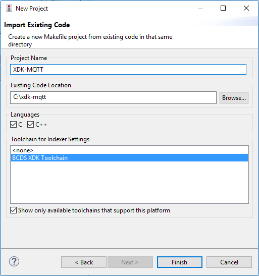
7.  Click on "Finish," and you'll see the brand new project added in the Project Explorer column on the left.
 
## 6. Introducing the WiFi and MQTT credentials

Let's hardcode the WiFi and the MQTT credentials of your device. First,
you'll need to connect the device. If you're using a virtual machine, you
will need to make XDK available in VirtualBox.

### Make XDK available in VirtualBox

**IMPORTANT: If you're not using a virtual machine, you can skip this first
set of steps and skip to the WiFi and MQTT credential sections below. Just
connect your XDK to the USB and turn it on by flipping the small switch on the
side of the device.**

1.  On the top navigation bar of VirtualBox, click on "Devices" → "USB" → "USB settings..."
2.  Now connect the XDK to a USB port, and turn it on (switch on the side of the device).
3.  Click on the small green icon on the right, and select the Bosch XDK.
4.  With this, you just created a filter that will give the virtual machine access to the USB device (i.e. your XDK). Now, disconnect the cable of the XDK and close the window.
5.  Now, once back in the Workbench, connect the cable of the XDK again. You should hear a sound indicating that a USB device has been connected, and on the top left side of the workbench, your XDK should be shown in green.
 
### WiFi credentials

Follow these steps to configure the XDK with the credentials of the WiFi network:

1.  On the folder of the project (left vertical window), expand the "config" folder and double click on the file named `credentials.h`.
2.  Find the fields labeled `WLAN_CONNECT_WPA_SSID` and `WLAN_CONNECT_WPA_PASS`. Enter the WiFi network and the password as shown here:
  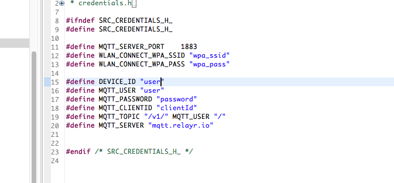
3.  Once you've entered the credentials, click "File" → "Save All."
  
### MQTT credentials

 In order to retrieve the XDK's MQTT credentials, we'll have to create the device on the [relayr Developer Dashboard](http://developer.relayr.io), for which you'll need a relayr developer account. [Click here for instructions on how to make an account.](http://docs.relayr.io/getting-started/account-creation/#creating-an-account)

 When you've created your account, [follow these instructions on how to add your device to the cloud.](http://docs.relayr.io/getting-started/devices-guide/#adding-a-device) When selecting a model, go to the "By the community" section and, in the search box, type "XDK." Select the one highlighted in the screenshot below:  

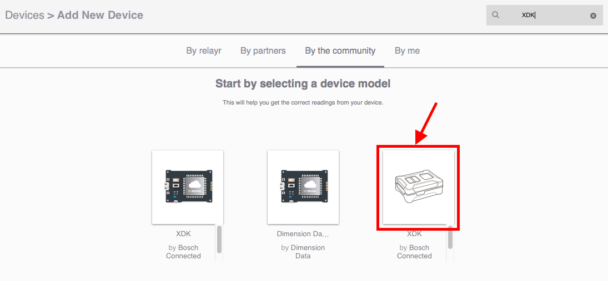

Once the device has been successfully added, click on the Edit button, and a
window with all the device's settings will pop up, including the MQTT
credentials.
  
```
{
    "user": "xxxxxxxxxxxxxxxxxxx",
    "password": "xxxxxxxxxxxxxxx",
    "clientId": "xxxxxxxxxxxxxxx",
    "topic": "/v1/xxxxxxxxxxxxxx/"
}
```
  
Now, on the XDK Workbench, on the directory tree (left side of the window), go
to the folder "config" and double click on the file `credentials.h`.

Modify the existing data, overwriting any existing data - convert table see
below.


   
JSON file | credentials.h
------------ | -------------
`user` | `MQTT_USER`
`user` | `DEVICE_ID`
`password` | `MQTT_PASSWORD`
`clientId` | `MQTT_CLIENTID`
`topic` | `MQTT_TOPIC`
   
Now click on "File" → "Save All".

#### Association with Vertex

**NOTE:** This documentation will not be necessary when using the Vertex
dashboard, since this process is implemented automatically. This section
describes the required manual process until the dashboard is ready for
release.

##### Create a Device In the Developer Dashboard

See section above.

**NOTE:** You must log in to the account where Vertex has been onboarded.
All devices that will be associated with Vertex must be on the same account as
Vertex itself.

##### Parameters

The following parameters are required in order to associate the device with Vertex:

-  `Vertex Id`: UUID of your Vertex gateway. Once you're done with the section ["Configuration & Onboarding"](http://docs.relayr.io/iot-starter-kits/dsk/vertex/#configuration--onboarding), the gateway should show up as another device. This UUID simply corresponds to the "device ID" of the gateway, that can be displayed as described [here](http://docs.relayr.io/getting-started/devices-guide/#editing--deleting-a-device).
-  `Authorization Token`: A token that authorizes you to make API calls to your user account and - devices that you manage. [Here is more info about it](http://docs.relayr.io/getting-started/account-creation/#user-id-and-authorization-token) and where to retrieve it.
-  `Device Id`: UUID of the device that will be associated with Vertex. Provided by the relayr - platform [when adding a device](http://docs.relayr.io/getting-started/devices-guide/).
-  `User`: MQTT user, in this case the same as the `Device Id`.
-  `Password`: MQTT password. Provided by the relayr platform [when adding a device](http://docs.relayr.io/getting-started/devices-guide/).
-  `MQTT Server Hostname`: The IP address of your Vertex gateway. This is not specifically required in this step, but it will be added into the code examples. For more information, please refer to the step #8 of the section ["Configuration & Onboarding"](http://docs.relayr.io/iot-starter-kits/dsk/vertex/#configuration--onboarding) as described on the Vertex documentation.

##### Using cURL

Open the terminal (or CLI), fill in the variables in the request shown below
with your own parameters, and press enter:

```
curl -H "Content-Type: application/json" -H "Authorization: Bearer {your Authorization Token}" -X POST -d '{"deviceId": "{your Device Id}","transport": "mqtt","credentials": {"user": "{your Device Id}","password": "{your Password}"},"configuration": {}}' http://prod-vertex.relayr.io:8081/vertices/{your Vertex Id}/devices
```

##### Using Postman

The POST request to associate your device with Vertex can also be done using Postman. 
If you are not familiar with Postman, you may have a look at [this tutorial](https://www.getpostman.com/docs/requests).

Fill in the following parameters to make the request:

**POST URL:**
`http://prod-vertex.relayr.io:8081/vertices/{your Vertex Id}/devices`

**Headers:**

-  `Authorization: Bearer {your Authorization Token}`
-  `Content-Type: application/json`

**Body:**

```
{
  "deviceId": "{your Device Id}",
  "transport": "mqtt",
  "credentials": {
    "user": "{your Device Id}",
    "password": "{your Password}"
  },
  "configuration": {}
}

```
 
 
## 7. Compile and flash the device

To compile and flash the firmware to your XDK, connect the XDK to your
computer and click on "Flash" at the top left of the window.

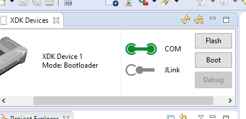

If your device has not yet been detected (because you're using a virtual
machine), please repeat the first part of the section labeled "Introducing the
WiFi and MQTT Credentials," which you will find above. In some cases, you may
need to repeat these steps a few times until it works! In VirtualBox, you can
add and remove USB devices easily, so feel free to remove the XDK from the
list and add it again after disconnecting and reconnecting it!

Once the device is flashed, simply disconnect and reset it (with the switch on
the side). After rebooting, it should start publishing data to the cloud.

 
## 8. Check XDK onboarding

Connect to [relayr Developer Dashboard](http://developer.relayr.io) and go to "Devices" → "your device name".
There you should see data from the XDK. See picture below:
 
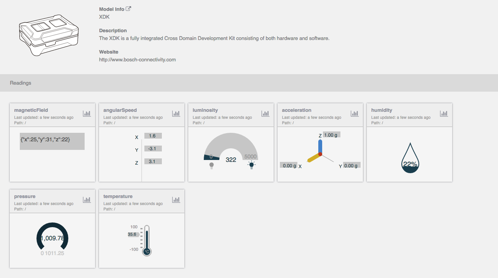
 
 
 

