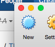

# Bosch XDK onboarding 

## 1. Introduction

This document contains instructions on how to onboard XDK and compile XDK firmware.
It begins with a list of prerequisities and guidelines on how to get the code, compile and onboard XDK.

## 2. Prerequisities

### 2.1. List of components

 -  Virtual box (if you have a Windows PC, you don't need it)
 -  Windows (in this tutorial version 10 home edition is used)
 -  XDK Workbench ([release 1.6.0](http://xdk.bosch-connectivity.com/software-downloads)) 
 -  Relayr firmware ([xdk-mqtt](https://github.com/relayr/xdk-mqtt) )
 

## 3. Installing Windows in a virtual machine
If you don't have a Windows computer, you will need to set up a virtual machine, and install Windows. 
In this example we'll be using Windows 10 Home Edition:
 - Download [VirtualBox](https://www.virtualbox.org/wiki/Downloads)
 (If you have a Mac, choose: "VirtualBox 5.0.20 for OS X hosts" →  amd64)
 - After installing it, download the iso image of [Windows 10](https://www.microsoft.com/en-us/software-download/windows10ISO) (Get the 64-bit version, and select your language)
 - Once finished, go to VirtualBox, and click on "New":
 
 
 - Name it as "Windows 10", and it will automatically select the settings; click on continue.
 
 
 
 - Continue with all the default options, and when asked for a Hard Disk, select "create a virtual hard disk now," and click on "create."
 - On the next step, select "VDI (Virtual Disk Image)", and click on "continue."
 - Now select "fixed size," and continue.
 - Name your virtual hard disk, and allocate a space of no less than 16GB.
 - Click on "create," and (if asked) continue with all the default options.
 - On the main window, on VirtualBox, click on your brand new virtual machine, and scroll down to storage. Now click on "Optical Drive" (see picture below, marked in blue).
 
 - Select the iso image of Windows 10 that you downloaded before, in the first steps of the tutorial.
 - Now click on "Start" tho run the virtual machine; shortly you will see the Windows 10 boot screen.

  

 - Now install Windows normally, using the default options; when prompted to introduce a "product key," select "I don't have a product key" (this is not a big deal, you can continue using the trial period).
 - Once you're set, you can start and shut down the virtual machine, as if it were another computer
 
 
## 4. Settings up the XDK workbench
All these instructions are to be performed in a Windows computer (or in your brand new Virtual Machine).
This tutorial is intended to be simple and accessible to everyone, and thus, it doesn't use git nor other command line tool.


 - Download the [XDK Workbench (release 1.6.0)](http://xdk.bosch-connectivity.com/software-downloads).
 - Install it with the default options (i.e. don't modify the default folder or anything!).
 - Download the latest version of the repository with the relayr [XDK project](https://codeload.github.com/relayr/xdk-mqtt/zip/master), or [here] (https://github.com/relayr/xdk-mqtt/tree/dev-ev), and uncompress it in "C:/" (in the root folder of the hard drive!).
 - Install it with the default options, and in the folder that the installer wants.
 - If you did everything right, at the end of this process, now you should have three new folders in your hard drive, as shown below:
 
 
## 5. IMPORTING THE PROJECT IN THE XDK WORKBENCH
Now let's import the project in the XDK Workbench, so you can flash your own XDKs from now on:
 - Open the XDK Workbench...
 - 
   

 - The first time you open it, it will ask you to set a password, ignore this (click "no"), and continue.
 - Now, close the tab that shows up with the welcome suggestions.
  
*IMPORTANT: DO NOT UPGRADE THE WORKBENCH! IGNORE THE "NEW VERSION" MESSAGES!*
  
 - Next, click on "file" → "new" → "project"
 - Inside the category "C/C++" select "makefile project with existing code."
 
   
 
 - Now introduce these details in the following window, as shown below (you can select your xdk-mqtt repository folder manually too):
 - 
 

 - Click on "finish," and you'll see the brand new project added on the left window.
 
 
## 6. Introducing the WiFi and MQTT credentials
Let's hardcode the WiFi and the MQTT credentials of your device. But first we'll need to connect our device, and if you're using a virtual machine, you will need to make it available to it.

*IMPORTANT: if you're not using a virtual machine, you can skip this first bunch of steps and jump to the part where the WiFi and MQTT credentials are introduced (below); just connect your XDK to the USB, and turn it on (small switch on the side of the device).*

 - On the top navigation bar of VirtualBox, click on "devices" → "USB" → "USB settings..."
 - Now connect the XDK to a USB port, and turn it on (switch on the side of the device).
 - Click on the small green icon on the right, and select the Bosch XDK.
 - With this, you just created a filter that will give the virtual machine access to the USB device (i.e. your XDK). Now, disconnect the cable of the XDK, and close the window.
 - Now, once back in the Workbench, connect the cable of the XDK again. You should hear a sound indicating that a USB device has been connected, and on the top left side of the workbench, your XDK should be shown in green.
 
### WiFi credentials
 - Now let's introduce the credentials of the WiFi network:
 - On the folder of the project (left vertical window), go to the folder "config" and double click on the file named "credentials.h"
 - Find the fields WLAN\_CONNECT\_WPA\_SSID and WLAN\_CONNECT\_WPA\_PASS. You may introduce the WiFi network and the password, as shown in the screenshot below:
    
 
 - After that, click on "File" → "Save All."
  
### MQTT credentials:
 - To retrieve our MQTT credentials we'll have to create the device onto the relayr Developer Dashboard.
 - For that, you'll need an account. It's pretty straight forward. [Simply follow these steps](http://docs.relayr.io/getting-started/account-creation/#creating-an-account) .
 - Once you're set, proceed to adding a new device, [here's how](http://docs.relayr.io/getting-started/devices-guide/#adding-a-device). When selecting a model, go to "By the community," and on the search box, type "XDK." Of the displayed models, select the one highlighted on the screenshot below:
  
 - Once the device has been successfully added, click on the edit button as shown here and a window with all the settings will pop up, including the MQTT credentials.
  
``` 
{
    "user": "xxxxxxxxxxxxxxxxxxx",
    "password": "xxxxxxxxxxxxxxx",
    "clientId": "xxxxxxxxxxxxxxx",
    "topic": "/v1/xxxxxxxxxxxxxx/"
}
```
  
 - Now, on the XDK Workbench, on the directory tree (left side of the window), go to the folder "config" and double click on the file "credentials.h".
 - Modify the existing data, overwriting any existing data - convert table see below.
   
   
Json file | credentials.h
------------ | -------------
user | MQTT_USER
user | DEVICE_ID
password | MQTT_PASSWORD
clientId | MQTT_CLIENTID
topic | MQTT_TOPIC
   
 - Now click on "File" → "Save All".
 
 
## 7. Compile and flash the device
 - Simply click on "Flash" on the top left window after connecting your XDK.  
  
 - If your device is not detected yet (because you're using a virtual machine) please repeat the first part of the section "INTRODUCING THE WIFI AND MQTT CREDENTIALS" which you will find above. In some cases, you may need to repeat these steps a few times until it works! In VirtualBox you can add and remove USB devices easily, so feel free to remove the XDK from the list, and add it again after disconnecting and reconnecting it!
 - Once the device is flashed, simply disconnect and reset it (with the switch on the side). After rebooting, it should start publishing data onto the cloud.
 

 
 
 

